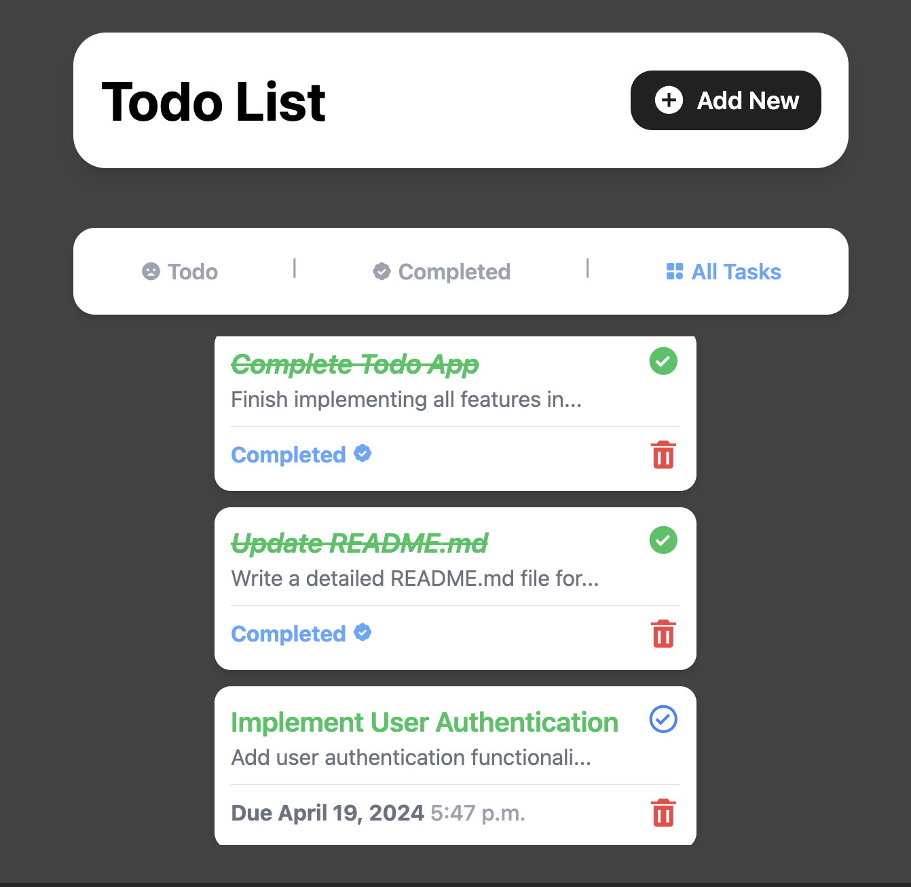

# Todo App with Django

Welcome to the Todo App with Django! This project is a simple todo list application built using the Django framework. The app allows users to manage their tasks by adding, completing, and removing todos. It also includes an admin section for managing todo items.

## Screenshots

## Features

- Add new todos with title and description
- Mark todos as completed
- Remove todos
- Admin section for managing todos
- Responsive design for mobile and desktop

## Getting Started

To run the project on your local machine, follow these steps:

### Prerequisites

- Python (3.6 or higher)
- Django

### Installation

1. Clone the repository:
 ``git clone https://github.com/your-username/todo-app.git``
2. Navigate to the project directory:
3. Install dependencies:
``pip install -r requirements.txt``
4. Run migrations to create the database:
``python manage.py migrate``

### Usage

1. Start the development server:
``python manage.py runserver``
2. Open your web browser and go to [http://127.0.0.1:8000](http://localhost:8000) to access the todo app.

### Admin Section

1. Create a superuser:
``python manage.py createsuperuser``
2. Enter your desired username, email, and password.
3. Access the admin panel by navigating to [http://127.0.0.1:8000/admin](http://localhost:8000/admin) and log in using the superuser credentials.

